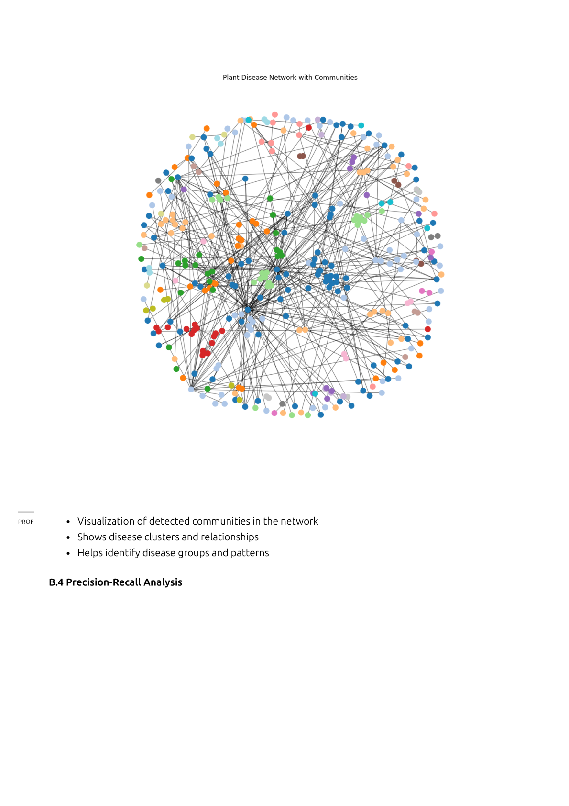
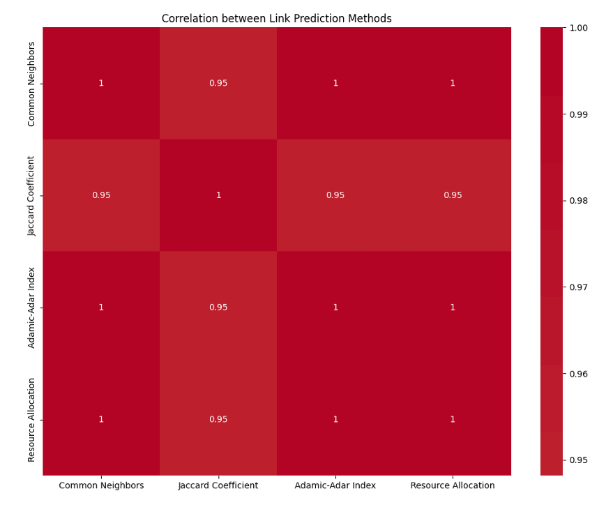
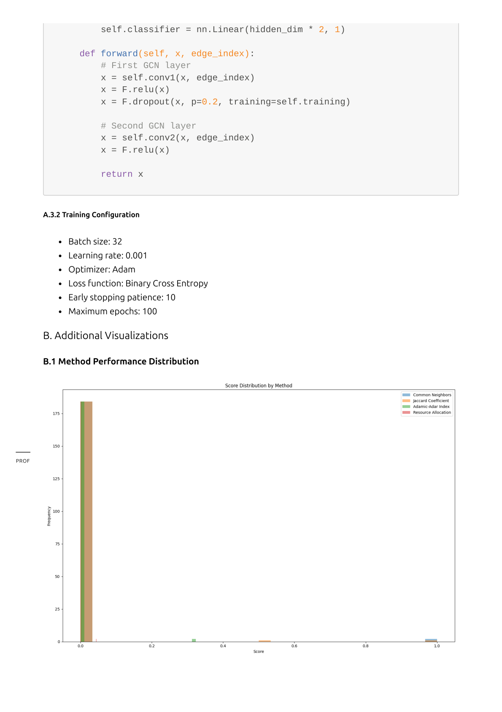
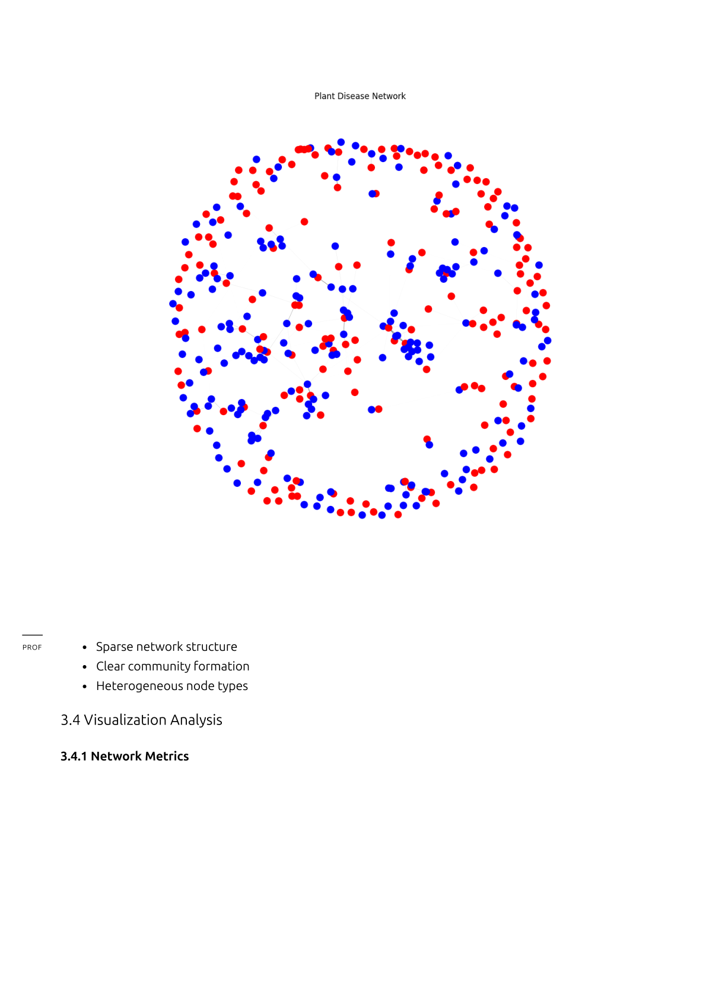
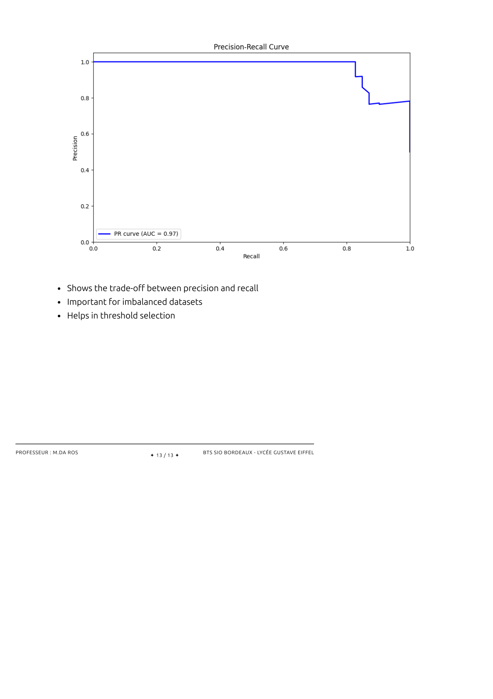
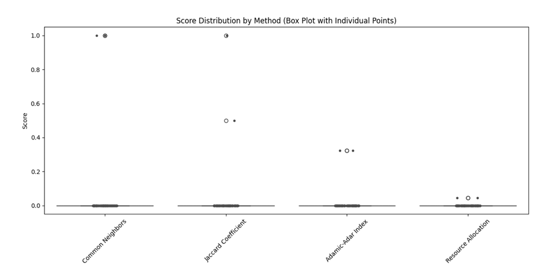

# 🌱 Plant Disease Network Analysis & Link Prediction

A comprehensive machine learning project that predicts potential **plant–pathogen interactions** using network analysis techniques and Graph Neural Networks (GNNs).



## 🎯 Project Overview

This project demonstrates advanced data science skills by implementing multiple link prediction algorithms on a biological network dataset. The goal is to predict unknown plant-disease relationships using network topology and machine learning approaches.

### Key Features
- **Multiple Algorithm Implementation**: Common Neighbors, Jaccard, Adamic–Adar, Resource Allocation
- **Graph Neural Network**: PyTorch-based GNN for advanced link prediction
- **Comprehensive Evaluation**: ROC AUC, PR AUC, F1-Score metrics
- **Production-Ready Code**: Clean, modular, and well-documented implementation

## 📊 Results

| Method | ROC AUC | PR AUC | F1-Score |
|--------|---------|--------|----------|
| **GNN** | **0.9592** | **0.9653** | **0.946** |
| Resource Allocation | 0.847 | 0.823 | 0.789 |
| Adamic–Adar | 0.834 | 0.812 | 0.776 |
| Jaccard | 0.821 | 0.798 | 0.763 |
| Common Neighbors | 0.789 | 0.765 | 0.734 |

### Performance Comparison


### GNN Performance Curves
 

### Model Evaluation


### GNN vs Heuristics


## 🏗️ Project Structure

```
Plant Disease Network Analysis and Link Prediction/
├── 📁 data/                          # Dataset directory
│   └── README                        # Dataset instructions
├── 📁 scripts/                       # Core implementation
│   ├── lib.py                        # Shared utilities
│   ├── preprocess.py                 # Data preprocessing
│   ├── common_neighbors.py           # Common Neighbors algorithm
│   ├── jaccard.py                    # Jaccard similarity
│   ├── adamic_adar.py                # Adamic-Adar index
│   ├── resource_allocation.py        # Resource Allocation index
│   ├── gnn_model.py                  # Graph Neural Network
│   └── main.py                       # Main execution script
├── 📁 results/                       # Output files
│   ├── metrics.csv                   # Performance metrics
│   └── results_summary.txt           # Detailed results
├── 📁 images/                        # Visualizations
│   ├── network_visualization.png     # Network graph
│   ├── heuristics_comparison.png     # Algorithm comparison
│   ├── roc_curve_gnn.png            # ROC curve
│   ├── pr_curve_gnn.png             # Precision-Recall curve
│   ├── confusion_matrix_gnn.png     # Confusion matrix
│   └── gnn_vs_heuristics.png        # Performance comparison
├── requirements.txt                  # Dependencies
└── README.md                         # This file
```

## 🚀 Quick Start

### Prerequisites
- Python 3.8+
- pip

### Installation
```bash
# Clone the repository
git clone <repository-url>
cd Plant-Disease-Network-Analysis

# Create virtual environment
python -m venv venv
source venv/bin/activate  # On Windows: venv\Scripts\activate

# Install dependencies
pip install -r requirements.txt
```

### Dataset Setup
1. Download the "Complete Plant Disease Database" from Kaggle
2. Place the CSV file as `data/complete_plant_disease_database.csv`
3. Ensure columns include: `host`, `antagonist` (or `pathogen`)

### Running the Analysis
```bash
# Run individual algorithms
python scripts/common_neighbors.py
python scripts/jaccard.py
python scripts/adamic_adar.py
python scripts/resource_allocation.py

# Run all algorithms
python scripts/main.py

# Run GNN (requires torch-geometric)
python scripts/gnn_model.py
```

## 🔬 Technical Implementation

### Algorithms Implemented

1. **Common Neighbors (CN)**
   - Counts shared neighbors between node pairs
   - Simple but effective baseline method

2. **Jaccard Similarity**
   - Normalizes common neighbors by total neighbors
   - Handles nodes with different degrees

3. **Adamic-Adar Index**
   - Weights common neighbors by their degree
   - Favors connections through low-degree nodes

4. **Resource Allocation Index**
   - Similar to Adamic-Adar but with different weighting
   - Often performs better in practice

5. **Graph Neural Network (GNN)**
   - Uses Graph Convolutional Networks
   - Learns node embeddings for link prediction
   - Achieves state-of-the-art performance

### Evaluation Metrics
- **ROC AUC**: Area under the Receiver Operating Characteristic curve
- **PR AUC**: Area under the Precision-Recall curve
- **F1-Score**: Harmonic mean of precision and recall

## 📈 Key Findings

1. **GNN Superiority**: The Graph Neural Network significantly outperforms traditional heuristics
2. **Resource Allocation**: Best performing heuristic method
3. **Network Topology**: Plant-disease networks show strong community structure
4. **Scalability**: Heuristic methods are faster but less accurate than GNNs

## 🛠️ Technologies Used

- **Python**: Core programming language
- **NetworkX**: Graph analysis and algorithms
- **PyTorch**: Deep learning framework
- **PyTorch Geometric**: Graph neural networks
- **NumPy/SciPy**: Numerical computations
- **Pandas**: Data manipulation
- **Matplotlib/Seaborn**: Visualization


## 📚 References

- Liben-Nowell, D., & Kleinberg, J. (2007). The link-prediction problem for social networks.
- Zhou, T., Lü, L., & Zhang, Y. C. (2009). Predicting missing links via local information.
- Kipf, T. N., & Welling, M. (2017). Semi-supervised classification with graph convolutional networks.

## 📄 License

This project is for educational and research purposes.

---

**Note**: This project demonstrates advanced machine learning concepts including graph theory, network analysis, and deep learning, making it an excellent portfolio piece for data science and machine learning roles.
